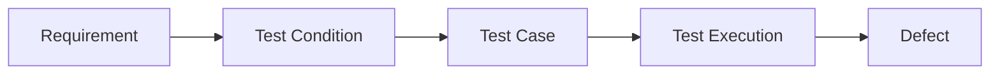
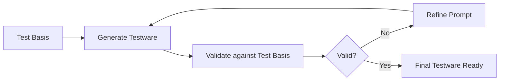

# AI Support for Testing

---

## Purpose

In this folder, I document how I use AI as support in my testing process.

I apply this approach to the system under test:

- Demo Web Shop (Tricentis)

I use AI to generate initial testware such as:

- Test Conditions from the Test Basis
- Test Cases based on Test Conditions
- Improve clarity in Test Conditions and Test Cases
- Suggest test scenarios based on the Test Basis
- Standardize the format of the artifacts

AI does not replace my work as a tester. I always validate the testware against the Test Basis.

---

## Relation to stlc

This module does not belong directly to the stlc.

I use it as support in:

- Test analysis → to identify Test Conditions  
- Test design → to create Test Cases  

---

## System under test

The testing is done on:

- Demo Web Shop (Tricentis)

It is a web application for e-commerce used to practice testing.

---

## Input (test basis)

To use AI, I need:

- Requirements
- User Stories
- Acceptance Criteria

These elements form the Test Basis of the Demo Web Shop system.

---

## Output (test artifacts)

With AI I generate testware that I validate before use:

- Test Conditions
- Test Cases

This testware is used as support in different stlc phases.

---

## Artifacts navigation

### Core files

| Artifact | Description |
|----------|------------|
| [`ai-usage-guidelines.md`](ai-usage-guidelines.md) | Rules for the use of AI |
| [`ai-output-validation.md`](ai-output-validation.md) | Testware validation with AI |

---

### Prompts (single source)

| Artifact | Description |
|----------|------------|
| [`prompts/system-prompt.md`](prompts/system-prompt.md) | Defines the role QA Manual Junior |
| [`prompts/evaluation-prompt.md`](prompts/evaluation-prompt.md) | Evaluates the quality of the testware |
| [`prompts/format-prompt.md`](prompts/format-prompt.md) | Standardizes the testware format |

---

### Phase prompts (use per stlc phase)

| Artifact | Description |
|----------|------------|
| [`phase-prompts/test-analysis.md`](phase-prompts/test-analysis.md) | AI support for test analysis |
| [`phase-prompts/test-planning.md`](phase-prompts/test-planning.md) | AI support for test planning |
| [`phase-prompts/test-design.md`](phase-prompts/test-design.md) | AI support for test design |
| [`phase-prompts/test-execution.md`](phase-prompts/test-execution.md) | AI support for test execution |
| [`phase-prompts/defect-management.md`](phase-prompts/defect-management.md) | AI support for defect management |
| [`phase-prompts/test-closure.md`](phase-prompts/test-closure.md) | AI support for test completion |

---

### Usage

| Artifact | Description |
|----------|------------|
| [`usage/prompt-chain-flow.md`](usage/prompt-chain-flow.md) | Prompt usage flow |

---

## Traceability flow

---

## Notes

> [!NOTE]
> I use AI to generate initial testware for Demo Web Shop, but I always validate against the Test Basis.
> I do not assume system behavior not defined in the Requirements.

---

## Warnings

> [!WARNING]
> Using AI can produce:
>
> - Hallucinations (information not based on the Test Basis)
> - Reasoning errors (mistakes in the Test Case logic)
>
> This is why I do manual validation before using the testware.

---

## Phase workflow

---

## Summary

In this module:

- I use AI to generate Test Conditions and Test Cases for Demo Web Shop
- I validate the testware against the Test Basis
- I keep traceability between Requirement, Test Condition, and Test Case
- I use structured prompts to improve the quality of the testware
