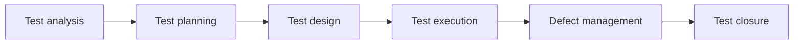
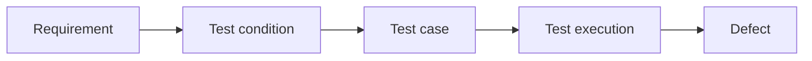

# 🧪 QA Manual Testing Portfolio
### **Practical Implementation of the Software Testing Life Cycle (STLC)**

*A comprehensive demonstration of test analysis, design, execution, and defect management.*

## 📌 Project overview

This repository contains a **QA manual testing project** developed as part of my learning process as a **QA manual junior**.

The goal is to understand and practice the testing process using the **STLC (Software Testing Life Cycle)** and core **ISTQB concepts** in a simulated environment.

> [!NOTE]
> This is a V1 version and will be updated as the project evolves.

---

## 👤 QA information

- **Author:** [https://github.com/LuisAdonais](https://github.com/LuisAdonais)
- **Level:** QA junior in process

---

## 🖥️ System under test (SUT)

- **Name:** Demo Web Shop (Tricentis)
- **Type:** Web application
- **URL:** https://demowebshop.tricentis.com/

For system context details:

- [`00-system-overview/system-under-test.md`](./00-system-overview/system-under-test.md)

> [!IMPORTANT]
> The detailed system description is maintained in `system-under-test.md`.

---

## 🎯 Testing objective

- Practice the STLC workflow
- Apply ISTQB concepts
- Build a QA portfolio
- Develop QA manual junior skills

---

## 📥 Test basis

- Requirements
- User stories
- Acceptance criteria

---

## 📦 Testing scope

### In scope

- User registration
- Login and logout
- Navigation
- Product view
- Shopping cart
- Checkout

> [!NOTE]
> Testing focuses on main flows only.

---

## 🧪 Testing approach

- Functional testing
- Smoke testing
- Exploratory testing

Based on:

- Requirements
- User stories

Level:

- Basic

---

## 🔁 STLC overview

---

## 📁 Repository navigation

| Folder                                            | Description                 |
| ------------------------------------------------- | --------------------------- |
| [`00-system-overview`](./00-system-overview/)     | System context (SUT)        |
| [`01-test-analysis`](./01-test-analysis/)         | Test conditions and RTM     |
| [`02-test-planning`](./02-test-planning/)         | Test plan                   |
| [`03-test-design`](./03-test-design/)             | Test cases and test data    |
| [`04-test-execution`](./04-test-execution/)       | Test execution and evidence |
| [`05-defect-management`](./05-defect-management/) | Defect reports              |
| [`06-test-closure`](./06-test-closure/)           | Test summary report         |
| [`07-ai-assisted-testing`](./07-ai-assisted-testing/) | AI support module        |

---

## 🤖 AI usage

AI is used as support in the testing process.

For details:

- [`07-ai-assisted-testing/README.md`](./07-ai-assisted-testing/README.md)

---

## 🔗 Traceability

---